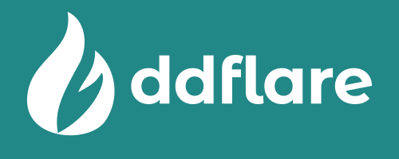

# 

ddflare is a [DDNS (Dynamic DNS)](https://en.wikipedia.org/wiki/Dynamic_DNS) library that allows DNS record
updates via either the [Cloudflare API](https://developers.cloudflare.com/api/) or
the [DynDNS update prococol v3](https://help.dyn.com/remote-access-api/perform-update/).

!!!Note
    The [DynDNS update prococol v3](https://help.dyn.com/remote-access-api/) is an HTTP API introduced
    back in the day by dyndns.org (now [Dyn](https://account.dyn.com/), part of Oracle) which is used by
    many of the available DDNS service providers available nowadays.

It comes with a CLI tool built on top of the library and released for different architectures.

!!!Tip
    In order to update your DNS records with ddflare you need a DNS domain registered with Cloudflare
    or a registratrion to a Dynamic DNS service provider
    (e.g., [No-IP](https://www.noip.com), [Dyn](https://account.dyn.com/), ...).

## Features

* Update a target domain name (FQDN, recorded as a type A record) to point to the current public address
or a custom IP.
* Retrieve and display the current public IP address.
* Resolve any domain name (acting as a simple DNS client).

